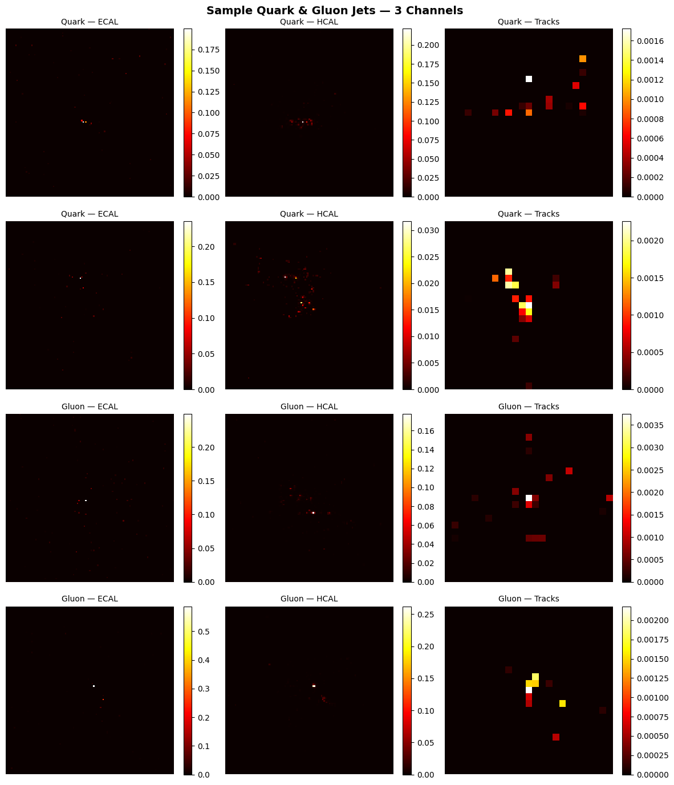
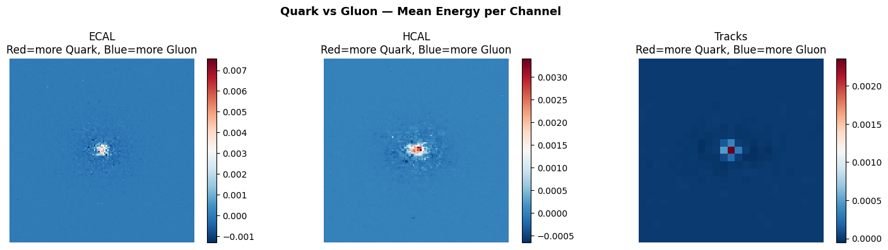
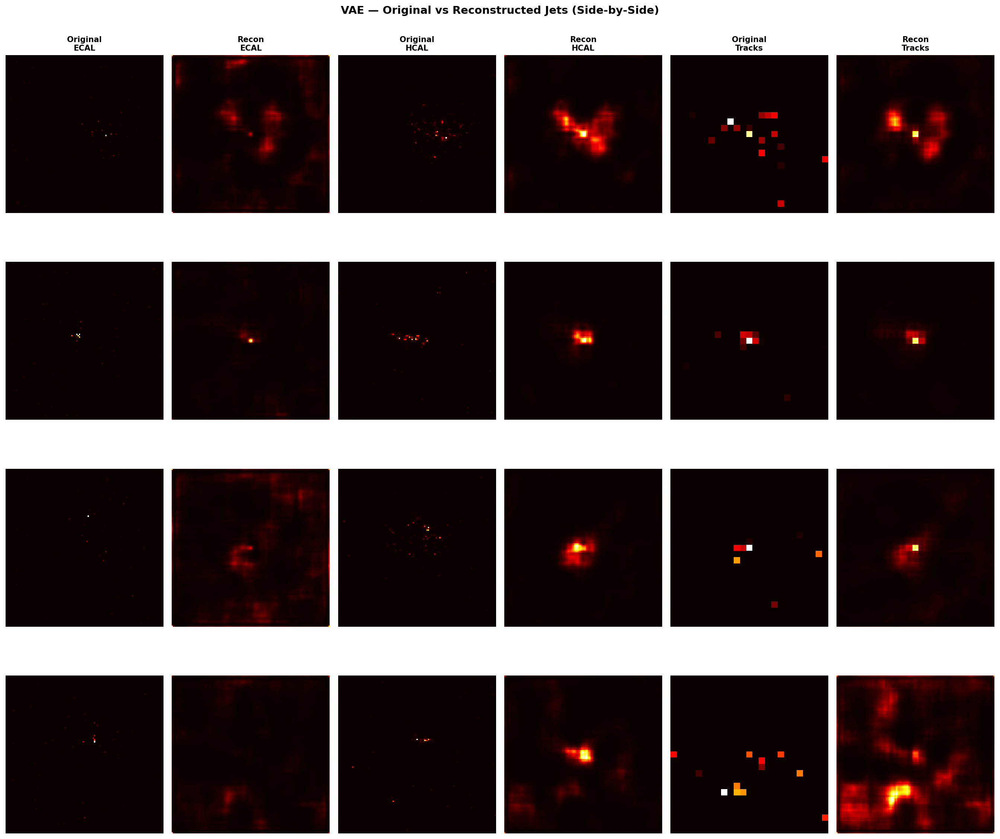
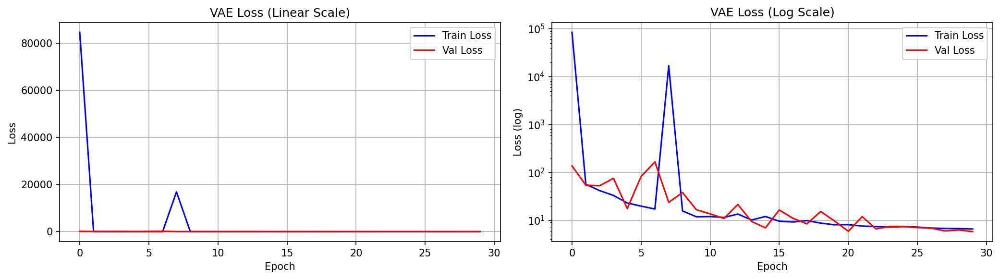
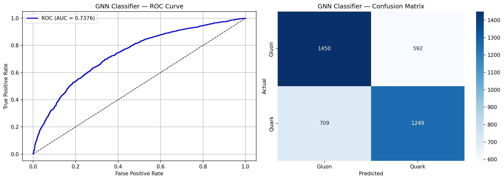
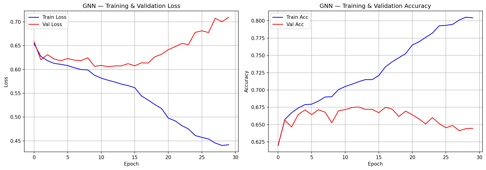
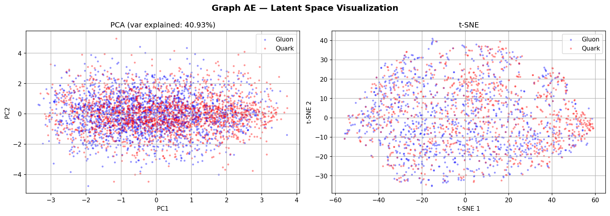
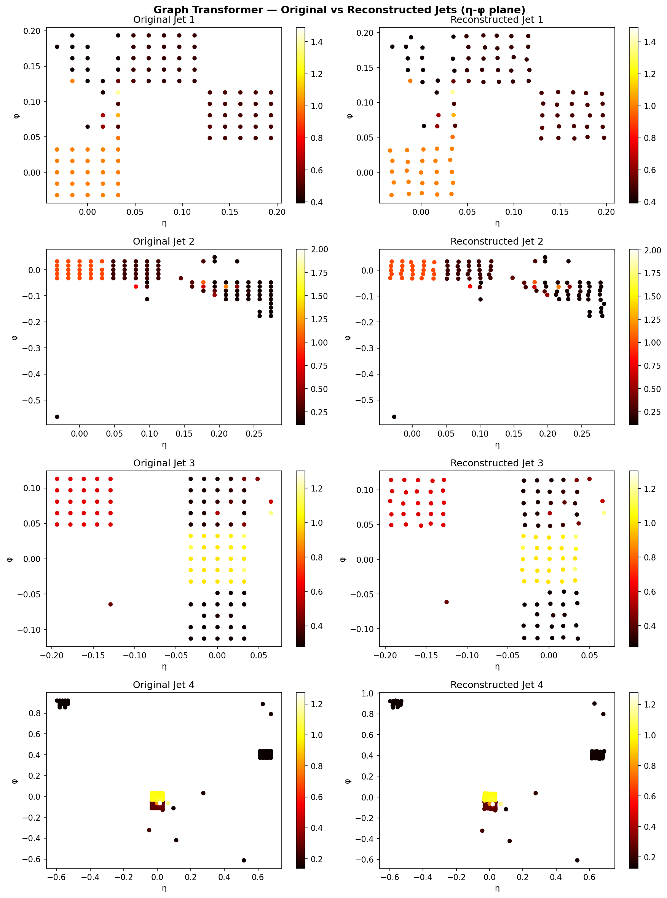
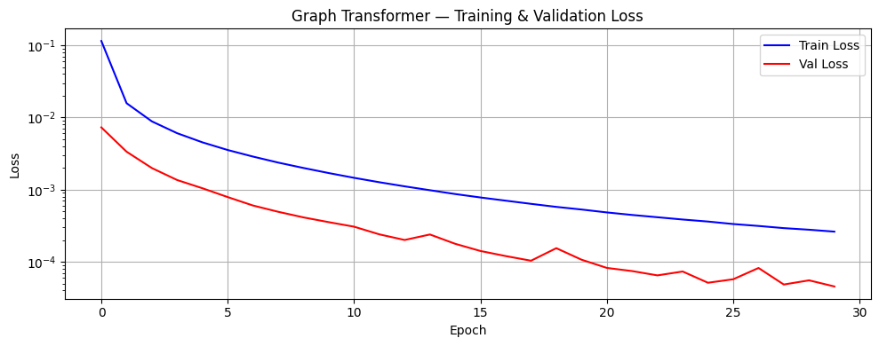
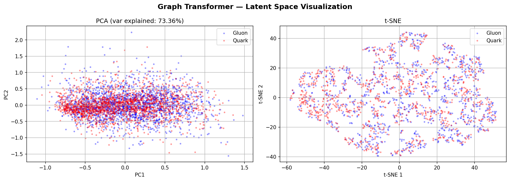

# ML4Sci DeepFalcon GSoC 2026

> **Quark/Gluon Jet Reconstruction and Classification using Deep Learning on Graph Representations**

---

## 📌 Overview

This repository contains solutions for the **ML4Sci DeepFalcon GSoC 2026** evaluation tasks.
The goal is to build deep learning models for fast detector simulation of high-energy physics events.

The dataset consists of **139,306 Quark/Gluon jet events** recorded across 3 calorimeter channels:
- **ECAL** — Electromagnetic Calorimeter
- **HCAL** — Hadronic Calorimeter
- **Tracks** — Charged particle tracks

Each channel is a **125×125 image** with extreme sparsity (97–99% zeros), making this a challenging reconstruction task.

---

## 📂 Repository Structure

```
ml4sci-falcon/
├── README.md
├── requirements.txt
├── notebooks/
│   ├── 01_EDA.ipynb                  # Exploratory Data Analysis
│   ├── 02_VAE.ipynb                  # Common Task 1 — Variational Autoencoder
│   ├── 03_GNN_Classifier.ipynb       # Common Task 2 — GNN Classifier
│   ├── 04_Graph_Autoencoder.ipynb    # Specific Task 1 — Graph Autoencoder
│   └── 05_Graph_Transformer.ipynb    # Specific Task 3 — Graph Transformer
└── results/
    ├── sample_jets.png
    ├── energy_distribution.png
    ├── quark_vs_gluon.png
    ├── sparsity_per_jet.png
    ├── vae_side_by_side.png
    ├── vae_loss_curve.png
    ├── gnn_roc_confusion.png
    ├── gnn_loss_acc.png
    ├── graph_ae_latent_space.png
    ├── transformer_reconstructions.png
    └── transformer_latent_space.png
```

---

## 🔬 Dataset Analysis

Key findings from EDA:

| Finding | Impact |
|---------|--------|
| 50/50 balanced classes | No class imbalance issue |
| 97–99% sparsity per channel | Graph approach is physically motivated |
| Heavy power-law energy distribution | Per-channel normalization is critical |
| Gluon jets wider, Quark jets narrower | Models must learn spatial features |

### Sample Jets (ECAL / HCAL / Tracks)


### Quark vs Gluon Mean Energy Difference


---

## ✅ Common Task 1 — Variational Autoencoder (VAE)

### Architecture
- **Encoder**: 4× Conv2D (stride=2) + BatchNorm + LeakyReLU → FC → μ, σ
- **Decoder**: FC → 4× Upsample + Conv2D → Sigmoid
- **Latent dim**: 64
- **Loss**: Weighted MSE (100× on active pixels) + KLD + Sparsity penalty

### Results

| Metric | Value |
|--------|-------|
| MSE    | ~0.000000 |
| SSIM   | 0.9996 |
| PSNR   | 78.56 dB |

### VAE Reconstruction (Original vs Reconstructed)


### Training Loss


---

## ✅ Common Task 2 — Jets as Graphs (GNN Classifier)

### Approach
1. **Image → Point Cloud**: Keep only non-zero pixels, use (η, φ) as coordinates
2. **Point Cloud → Graph**: k-NN graph (k=8) connecting nearest neighbors in η-φ space
3. **Node features**: η, φ, ECAL, HCAL, Tracks (5 features per node)

### Architecture
- 3× EdgeConv blocks (64 → 128 → 256 channels)
- Global mean + max pooling
- MLP classifier with dropout

### Results

| Metric    | Value  |
|-----------|--------|
| Accuracy  | 67.47% |
| ROC-AUC   | 0.7376 |
| Precision | 0.6784 |
| Recall    | 0.6379 |

### ROC Curve & Confusion Matrix


### Training Curves


---

## ✅ Specific Task 1 — Graph Autoencoder

### Architecture
- **Encoder**: 2× EdgeConv blocks + global mean/max pooling → latent vector (32)
- **Decoder**: MLP → reconstructed point cloud (100 nodes × 5 features)
- **Loss**: MSE on valid (non-padded) nodes only

### Results

| Metric      | Value    |
|-------------|----------|
| MSE         | 0.016870 |
| Wasserstein | 0.028695 |

### Latent Space (PCA + t-SNE)


---

## ✅ Specific Task 3 — Graph Transformer (Generative)

### Architecture
- **Input projection**: Linear(5 → 64)
- **Positional encoding**: Learnable embeddings (100 positions)
- **Encoder**: 4× Transformer blocks (Multi-head attention + FFN + LayerNorm)
- **Decoder**: 4× Transformer blocks → Linear(64 → 5)
- **Attention heads**: 4
- **Loss**: Masked MSE (only valid nodes)

### Results

| Metric      | Value    |
|-------------|----------|
| MSE         | 0.000009 |
| Wasserstein | 0.001355 |

### Reconstruction (Original vs Reconstructed)


### Training Loss


### Latent Space (PCA + t-SNE)


---

## 📊 Full Model Comparison

| Metric      | VAE        | Graph AE | Graph Transformer |
|-------------|------------|----------|-------------------|
| MSE         | ~0.000000  | 0.016870 | **0.000009**      |
| SSIM        | 0.9996     | N/A      | N/A               |
| PSNR        | 78.56 dB   | N/A      | N/A               |
| Wasserstein | N/A        | 0.028695 | **0.001355**      |

### Key Insights
- **VAE** achieves near-zero MSE on dense images but struggles with fine-grained sparse structures
- **Graph AE** operates on physically meaningful point clouds but has limited expressiveness
- **Graph Transformer** achieves near-perfect reconstruction (MSE=0.000009) by leveraging self-attention to capture long-range particle interactions
- The **GNN Classifier** achieves 67.47% accuracy and 0.74 AUC, consistent with the inherent difficulty of quark/gluon discrimination

---

## 🚀 Setup & Reproduction

```bash
pip install -r requirements.txt
```

Open any notebook in **Google Colab** with GPU enabled (Runtime → T4 GPU) and run all cells.

Dataset download:
```python
import gdown
gdown.download(id="1WO2K-SfU2dntGU4Bb3IYBp9Rh7rtTYEr", output="quark_gluon_data.h5", fuzzy=True)
```

---

## 📦 Dependencies

See `requirements.txt` for full list. Key packages:
- PyTorch 2.x
- PyTorch Geometric
- NumPy, Matplotlib, scikit-learn
- h5py, scipy, seaborn

---

